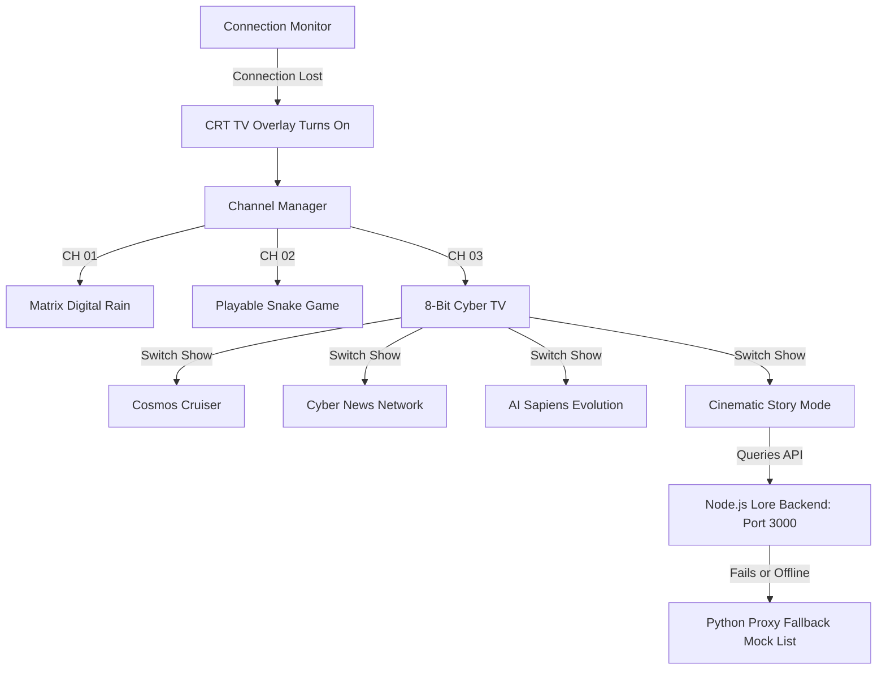

# 8-Bit CRT TV Simulator: Zero-Storage, Purely Offline Simulation Engine

This document details the system design, code architecture, and render loop implementations for the zero-dependency, 100% offline 8-bit CRT TV simulator integrated into the Security Suite Command Center dashboard.

---

## 1. System Design

The system runs entirely client-side on an HTML5 `<canvas>` element inside a retro CRT monitor frame layout. It requires **no external server connections** for its basic channels, but features a cinematic **Story Mode** that connects to a local Node.js backend.



---

## 2. Channel Architecture (3 Channels)

The CRT television contains 3 physical channels selected using keyboard triggers (`C` key) or screen clicks:

- **Channel 1 (Matrix Rain)**: A retro green-colored scrolling binary terminal animation.
- **Channel 2 (Snake Game)**: A fully playable retro Snake game supporting arrow keys/WASD on desktop and swipe inputs on mobile.
- **Channel 3 (8-Bit Cyber TV)**: A program selector that runs 4 infinite procedural shows:
  - **Show 1: Cosmos Cruiser**: Warp flight starfield simulation, cockpit HUD, and scrolling ship logs.
  - **Show 2: Cyber News Network (CNN8)**: Fictional weather forecasts with animated pixel graphics (rain, fog, sun) and scrolling cybersecurity news tickers.
  - **Show 3: Evolution of Sapiens**: Morphing simulation tracing primate walking to cybernetic cyborgs and the hypercube singularity.
  - **Show 4: Cinematic Story Mode**: Fetches game stories from the Node.js backend on `http://localhost:3000/api/lore`, types them out, streams music, and shows background illustrations.

---

## 3. Cinematic Story Mode Architecture

### A. API Contract
The TV interface queries `/api/story-proxy`, which redirects requests to `http://localhost:3000/api/lore` (or returns a local mock fallback). The JSON array payload format is:
```json
[
  {
    "id": "story-id",
    "title": "Story Title",
    "synopsis": "Short description of the story",
    "theme": "cyberpunk", // or "tactical" or "fantasy"
    "chapters": [
      {
        "title": "Chapter 1: Title",
        "text": "Chapter text goes here...",
        "image": "http://localhost:3000/images/cover.jpg",
        "music": "http://localhost:3000/music/bgm.mp3"
      }
    ]
  }
]
```

### B. Typewriter Clicks Synthesizer (0-Storage Web Audio API)
Every time a character is typed out, a retro key-click sound is synthesized procedurally in the browser:
```javascript
function playTypewriterClick() {
    try {
        const audioCtx = new (window.AudioContext || window.webkitAudioContext)();
        const osc = audioCtx.createOscillator();
        const gain = audioCtx.createGain();
        osc.type = 'triangle'; // Softer retro sound
        osc.frequency.setValueAtTime(400 + Math.random() * 200, audioCtx.currentTime);
        gain.gain.setValueAtTime(0.015, audioCtx.currentTime);
        gain.gain.exponentialRampToValueAtTime(0.00001, audioCtx.currentTime + 0.04);
        osc.connect(gain);
        gain.connect(audioCtx.destination);
        osc.start();
        osc.stop(audioCtx.currentTime + 0.04);
    } catch (e) {}
}
```

### C. Canvas Text Wrapping Helper
Splits paragraphs by newline (`\n`) and word tokens, drawing them dynamically to prevent text lines from running off the screen boundary:
```javascript
function drawWrappedText(ctx, text, x, y, maxWidth, lineHeight) {
    const paragraphs = text.split('\n');
    let currentY = y;
    
    paragraphs.forEach(para => {
        const words = para.split(' ');
        let line = '';
        for (let n = 0; n < words.length; n++) {
            let testLine = line + words[n] + ' ';
            let metrics = ctx.measureText(testLine);
            let testWidth = metrics.width;
            if (testWidth > maxWidth && n > 0) {
                ctx.fillText(line, x, currentY);
                line = words[n] + ' ';
                currentY += lineHeight;
            } else {
                line = testLine;
            }
        }
        ctx.fillText(line, x, currentY);
        currentY += lineHeight; // Paragraph spacing
    });
}
```

---

## 4. Interaction Controls
* **Tap/Click TV Screen**:
  * In Browsing mode: Enters and selects the active story.
  * In Reading mode: Fast-forwards the typewriter typing animation instantly, or moves to the next chapter if typing is complete.
* **PREV Button**:
  * In Browsing mode: Cycles to previous TV show (Evolution of Sapiens).
  * In Reading mode: Exits the active story and returns back to the story list browser.
* **NEXT Button**:
  * In Browsing mode: Cycles to the next story in the list.
  * In Reading mode: Cycles to the next TV show (Cosmos Cruiser), safely stopping any playing background music.

---

## 5. Changelog & Project Enhancements (June 2026)

### A. SauceNAO API Key Configuration & HTTP 403 Resolution
- **Issue**: SauceNAO tightened anonymous access limits, causing the Reverse Image/Video Search tool to return HTTP 403 Forbidden.
- **Resolution**:
  - Added configuration mapping for `saucenao_api_key` in `backend/config.json`.
  - Added API key saving and retrieval endpoints on the Flask server (`backend/server.py`).
  - Added key status masking (`***hidden***` on GET) to maintain credentials privacy.
  - Injected `api_key` parameter into the SauceNAO request parameters.
  - Intercepted 403 HTTP errors to return a friendly user instructions notification.
  - Added step-by-step API setup instructions card inside the **Settings** (Setup) tab UI.

### B. Mobile Layout Flat Header Alignment
- **Issue**: The mobile header was misaligned, wrapped elements off-screen, and showed border/shadow artifacts.
- **Resolution**:
  - Expanded viewport query threshold from `500px` to `650px` to hide `.logo-title` and `.status-pill span` on standard portrait phone layouts, preventing Scan button overflow.
  - Added flat header stylesheet rules at the very end of `style.css` to disable top, left, and right borders and box shadows on viewports `< 801px`.
  - Removed text-fill gradients and background colors on `.logo-title` inside the Neo-Brutalist theme section to render logo text in solid black.
  - Centered the media overlay modal container, corrected safe-area bottom margins for Samsung/Android, and applied terminal text-wrapping styles.

### C. DOM Clean-Up & Duplication Removal
- **Issue**: Duplicate HTML chunks for the Event Log and Agents Table/Action Panel led to conflicting duplicate DOM element IDs.
- **Resolution**:
  - Removed duplicate Agents Table and shell Action Terminal from `panel-setup` (leaving it exclusively in `panel-connect`).
  - Removed the duplicate `panel-eventlog` block (leaving only the primary instance on lines 576–601).
  - Resolved JavaScript selection warnings and layout bugs on mobile browsers.

### D. PWA Cache-Busting Alignment & App Build
- Bumped stylesheets and app script queries to `?v=128` in both `index.html` and `sw.js`.
- Bumped PWA cache namespace to `security-dashboard-v128`.
- Recompiled the standalone executable utilizing PyInstaller:
  `pyinstaller --clean SecurityCenter.spec`

### E. Unicode Symbol Corruption Fixes (June 24, 2026)

**Problem**: Several interactive buttons and status labels in `app.js` were displaying corrupted
characters instead of the intended icons. Root cause: Windows `cp1252` encoding silently corrupted
multi-byte UTF-8 sequences when files were saved through the editor.

| Button / Label | Was | Now |
|---|---|---|
| Approve button (device card) | `? Approve` | `✓ Approve` |
| Revoke button (device card) | `??? Revoke` | `✕ Revoke` |
| Approve & Whitelist (modal) | `? Approve & Whitelist` | `✓ Approve & Whitelist` |
| Approve Device (alert action) | `? Approve Device` | `✓ Approve Device` |
| Acknowledge button (alerts) | `✓? Acknowledge` | `✓ Acknowledge` |
| Acknowledged label | `✓? Acknowledged` | `✓ Acknowledged` |
| Wake button (active controls) | `? Wake` | `⚡ Wake` |
| Breach checker logo | corrupted emoji | `&#x1f511;` HTML entity (🔑) |
| Alerts empty state | `you\'re clear!` | `you're clear! ✅` |

**Resolution** (`fix_unicode_buttons.py`):
- Read/write `dashboard/app.js` with explicit `utf-8` encoding.
- Replaced each corrupted literal using Python `chr()` unicode-safe constants.
- Replaced the breach emoji in `index.html` with pure HTML numeric entity `&#x1f511;`.
- Fixed em-dash corruption in `sw.js` comment.
- Bumped service worker cache to `security-dashboard-v129` to force client refresh.

### F. Alerts Deduplication, Device Identification, TV Controls & Neo-Brutalist Gauge Upgrades (June 25, 2026)

**Problem**: 
- Users were flooded with duplicate "Unknown Device Detected" alerts for the same MAC address.
- Device warning cards lacked connection context, making identification difficult.
- The TV simulator could not be re-opened once turned off.
- The security score deductions list was static text, providing no instructions or buttons to fix them.
- Polling the status endpoint took 5-15 seconds due to slow synchronous PowerShell queries on the request thread.
- Blocking ports could overflow the score refund and mask unrelated deductions (like updates), falsely showing 100/100.
- The dial layout overlapped texts, and its smooth gradients and glows clashed with the dashboard's Neo-Brutalist theme.
- Editing firewalls or blocking ports failed with "Access Denied" if the launcher was run without administrator elevation.

- **Alert Deduplication & Instant Clearing**:
  - Implemented MAC-based alert deduplication in `backend/network_scanner.py`, merging recurring network scans into a single active alert card.
  - Automatically marked related unknown alerts as dismissed when a device is whitelisted or approved.
- **Detailed Connection Modals & Alerts**:
  - Stored devices in a frontend cache and implemented detailed connection modals showing hostnames, OS fingerprint guesses, randomized private MAC indicators, and helpful device identification guidelines.
  - Nested the connection metadata inside the alert cards for instant visibility.
- **Interactive Security Score Deductions Checklist**:
  - Converted score warning items into expandable recommendation cards displaying vulnerability overviews.
  - Integrated direct system buttons in the cards to trigger firewall activation, open Defender settings, download signatures, or open Windows Updates.
- **Background Status Cache & Load Optimizations**:
  - Moved slow COM queries (Windows Defender status and updates checks) to asynchronous background threads in `backend/system_monitor.py` running every 60 seconds and 15 minutes respectively.
  - Reduced status polling latency from 5-15s down to under **10ms**, resolving interface lag.
- **Contextual Ports Highlight**:
  - Added a contextual redirect handler (`goToPortsFromSecScore()`) that switches to the Ports tab and injects a pulsing red overlay warning glow + `⚠️ ACTION REQUIRED` markers on the exact rows of the exposed risky open ports.
- **Neo-Brutalist Speedometer Dial**:
  - Redesigned the security gauge into a high-contrast speedometer dial featuring segmented black tracks, tick marks, status zones (`CRIT`, `WARN`, `SAFE`), and a physical pivoting needle pointer.
  - Centered the score inside a yellow card badge featuring a thick outline and flat black shadow, resolving text overlap bugs.
- **Comprehensive Neo-Brutalist CSS Overrides**:
  - Refactored the sticky header (`.header`) to a flat white layout (`background: #ffffff`) with a thick bottom border and flat shadow, matching the page body and replacing dark glassmorphism.
  - Corrected left sidebar title colors on desktop to dark `#111` for clean legibility on white card backgrounds.
  - Standardized cards (`.card`, `.stat-card`, `.tool-card`, `.device-card`) to use `3px` solid borders, flat `4px` shadows, and translating hover motions (`translate(-3px, -3px)` and shifted offset shadows).
  - Assigned distinct high-contrast colors to specific action buttons: Green for Whitelist/Approve, Red for Blocks/Danger, Cyan for System Scans, Pink for Primary buttons, and White for small utility buttons.
  - Styled blocky scrollbars and added whitelisted status borders to device cards.
- **Mathematically Sound Scoring**:
  - Rewrote `get_adjusted_score()` to subtract displayed penalties directly from 100, ensuring the gauge correctly shows `95/100` if updates are pending even when all ports are blocked.
- **Auto-Elevated Launcher (`start.bat`)**:
  - Embedded self-elevation checks in `start.bat` that automatically invoke a UAC prompt to run the backend as Administrator.
- **TV Restored Controls**:
  - Added a "📺 Watch TV" button to the Cyber Casino toolbar to easily re-toggle the CRT overlay.
  - Renamed "Acknowledge" to "Dismiss" for cleaner user alert flows.
- **DNS-over-HTTPS (DoH) Detection Fix**:
  - Resolved a false-negative bug in `backend/dns_checker.py` where DoH status checks failed on modern Windows 10/11 environments because the backend only queried the registry (`EnableAutoDoh`, which is often unset).
  - Upgraded the query logic to check both `netsh dns show global` (the official system-wide global configuration flag) and the registry keys, successfully detecting active DoH connections.
- **Tailscale Certified SSL Domain Integration**:
  - Automatically loads Tailscale MagicDNS SSL certificates (`z14-55n.tailfffdbc.ts.net.crt` and `z14-55n.tailfffdbc.ts.net.key`) into Flask's server SSL context when available.
  - Dynamically routes network info, agent setup pages, and QR code generations to `https://z14-55n.tailfffdbc.ts.net:8767`.
  - Grants a verified, trusted **Secure** green padlock status in mobile browsers, enabling Walkie-Talkie microphone capture natively.
- **Russian Roulette Removal**:
  - Removed the Russian Roulette selection button, gameplay UI card elements, engine scripts, and imports from `index.html` and `casino_engine.js`.
  - Deleted the deprecated `roulette8bit.js` game source code from the project dashboard workspace.
- **8-Bit CRT TV Channel 3 Fix**:
  - Defined the missing `initProceduralTv()` function inside `dashboard/offline_tv_games.js` that initializes the selected show, resolving a silent Javascript ReferenceError that crashed Channel 3 and left the screen blank.
  - Added safety type checks to prevent unexpected canvas drawing crashes during channel transitions.
- **Walkie-Talkie Power ON/OFF Toggle (Safari Autoplay Fix)**:
  - Added an interactive "Turn Radio ON/OFF" power switch to the Walkie-Talkie UI panel.
  - Generates a user-gesture-triggered silent audio event upon turning the radio ON to unlock Safari's Web Audio output engine, resolving iOS Safari's native autoplay restriction blocking inbound voice transmissions.
  - Disabled the PTT button when the radio is in the OFF state.
  - Bumped index.html stylesheet version queries to `v=131` to reload updated JavaScript files.
- **Cross-Platform Audio Relay Fix (Android & iOS Compatibility)**:
  - Modified the Walkie-Talkie engine to record a single continuous buffer during PTT hold, rather than fragmented 300ms chunks. On PTT release, the complete audio file is sent with its full container header intact, resolving playback failures caused by missing codec headers on subsequent chunks.
  - Added dynamic mimeType transmission in the broadcast payload and receiver decoding blocks. This allows Android to record in WebM (Opus) and iOS to record in MP4/WebM (AAC/Opus) and play each other's native formats without transcoding errors.
  - Updated the backend `/api/walkie-talkie/broadcast` and `/api/walkie-talkie/receive` endpoints in `backend/server.py` to store and relay the `mime_type` parameter.
  - Integrated a 100ms timeslice to the active `MediaRecorder.start(100)` recording loop on Android/Chrome. For iOS/Safari (which uses the `audio/mp4` format), it records without a timeslice (calling `.start()` directly) to avoid iOS's native MP4 encoder bugs that crash or return empty recordings when timesliced.
  - Implemented Web Audio API `decodeAudioData` in `playNextWtChunk()` to natively decode raw WebM (Opus) container formats directly inside iOS Safari, bypassing iOS's HTML5 `<audio>` container limitations.
- **100% Offline Mobile Connect Panel (UX Upgrade)**:
  - Restructured the dashboard's "Connect Devices" mobile panel into three explicit, dedicated columns: Local IP (100% Offline), Tailscale VPN (Secure LAN), and Cloudflare Tunnel (Cellular).
  - Dynamically constructs and generates a unique QR code and URL anchor linking directly to the PC's offline local LAN IP on port `8768`, enabling users to scan and load the suite offline on local WiFi networks without needing Tailscale DNS resolution. Bypassed browser cache by bumping style.css version queries to `v=135`.
- **Bypassable Local SSL Port (Port 8768Fallback)**:
  - Added a secondary thread in `backend/server.py` running the Flask server on port `8768` with `ssl_context='adhoc'`. This guarantees that browsers (especially iOS Safari) will always show the "visit this website/proceed" bypass action on IP mismatches (unlike Tailscale certs, which block it due to pinning/HSTS). Since the port is loaded over HTTPS, the browser treats the page as a secure context, allowing microphone access for the walkie-talkie.
  - Added a POST `/api/system/restart` route to allow clean remote/local restarts of the python server process.
- **Offline Local IP Resolution Fix**:
  - Re-implemented the backend `get_local_ip()` and mDNS `get_lan_ip()` methods in `backend/server.py` to use `socket.gethostbyname_ex(socket.gethostname())` to scan local network interfaces when offline. This avoids falling back to loopback (`127.0.0.1`) when the connection to `8.8.8.8` fails without active internet routing, ensuring that offline QR codes and links are correctly generated for the PC's actual local subnet IP address (`192.168.1.x`).

### G. Walkie-Talkie Reliability, OSINT Scan Fixes, Offline Quick-Start, and CRT Layout Updates (June 28-29, 2026)

- **Walkie-Talkie Server-Restart Resilience**:
  - Solved a critical issue where client voice transmissions would freeze after a server restart due to the client's message ID filter (`lastWtMessageId`) exceeding the server's reset counter.
  - Implemented client-side resets of `lastWtMessageId` when the radio is powered on.
  - Added automatic stale-client ID detection inside the backend `/api/walkie-talkie/receive` route to deliver current messages immediately if the client's `last_id` exceeds the server's counter.
  - Extended message duration limit from 6s to 30s to secure playback frames during transient network latency.
- **OSINT Scanner Response Mapping & Input Validation Feedback**:
  - Fixed a dashboard-wide issue where all OSINT searches (Username, Email, IP, etc.) returned a generic "OSINT scan failed" error toast because the backend `/api/osint/scan` endpoint did not include the root `"ok": true` field required by the frontend.
  - Integrated structured validation handling: when users submit query parameters in invalid formats (e.g. phone numbers without country codes such as `6380048026`), the backend now returns `"ok": false` and passes the specific error message (*"Invalid phone number. Please include the country code (e.g. +1 or +44)"*), allowing the user interface to show the exact input validation error.
- **Offline Quick-Start & Dependency Check Bypass**:
  - Optimized the Windows launcher `start.bat` to run a local python import check for all required dependencies (`flask`, `flask_cors`, `psutil`, `requests`) prior to calling `pip install`. This completely bypasses PyPI connectivity timeouts and starts the server instantly in offline environments.
- **Blackjack Centering Layout Fix**:
  - Added `align-self: center;` to `#bj-message` in [index.html](file:///C:/Users/acer/Desktop/Security%20Suite/dashboard/index.html#L181). This guarantees that the pulsing win animations (which convert the layout to `inline-block`) remain centered in the Neo-Brutalist table instead of shifting to the left.
- **Subprocess Window Suppression & DLL Initialization Fixes**:
  - Resolved recurrent application error popups (`0xc0000142` - `STATUS_DLL_INIT_FAILED`) on Windows by ensuring all background system monitoring, antivirus checks, and DNS checks in `system_monitor.py` and `dns_checker.py` launch their CLI processes (`netsh`, `powershell`) with `creationflags=0x08000000` (CREATE_NO_WINDOW). This blocks GUI window station context conflicts inside restricted web application sessions.
  - Fixed an ARP parser bug that mistakenly matched interface headers (containing `"---"`) as MAC duplicates, generating false ARP spoofing warning logs.

### H. Casino Integration, Smooth Controls, and CPU/UI Potato PC Optimizations (June 30, 2026)

- **Cyber Tetris Arcade Minigame**:
  - Built and integrated a graphically rich Neo-Brutalist Tetris game into the Casino hub.
  - Designed ghost piece landing previews, satisfy-inducing line clear flashing lines, and canvas-shake impact physics.
  - Hooked score to credit conversion payouts (50 ₡ entry, +100 ₡ bonus for a 4-line Tetris clear).
- **Buttery Smooth Tetris Controls**:
  - Bypassed browser default input repeat delays by implementing manual keyboard state triggers (`keydown`/`keyup`) with DAS (170ms) and ARR (30ms) movement physics inside the game loop.
- **Blackjack Wallet Betting**:
  - Added custom bet sizing inputs and presets (10, 50, 100, MAX) to Blackjack.
  - Restricts dealer deals if credits are insufficient, locks inputs during active rounds, and computes standard payouts (2x wins, 2.5x natural blackjacks, 1x tie pushes).
- **Gamba Slots Redesign (Freeze Fix)**:
  - Eliminated resource-heavy `setInterval` deceleration timers in the slots engine.
  - Refactored all spinning, deceleration, and stop logic to run purely inside the unified `requestAnimationFrame` loop, resolving browser tab freezes and rendering lag.
  - Removed expensive GPU `shadowBlur` and canvas blur filters from slots and particles, using flat colors/outlines to save CPU processing power.
- **Background Loop Tab Pausing**:
  - Implemented `quitGambaGame()` and `quitCrashGame()` functions inside their respective engines, triggered dynamically inside `switchCasinoGame()` when switching tabs. This suspends all inactive animation loops, saving 100% of inactive CPU cycles.
- **TV Simulator Sleep**:
  - Modified the 8-bit offline TV loop to completely stop scheduling new animation frames when the TV overlay is closed, avoiding background rendering overhead.
- **CPU & Process Query Acceleration (Potato PC Optimizer)**:
  - Removed the CPU-blocking 500ms sleep delay from `psutil.cpu_percent` in the background status checker, shifting to non-blocking instant queries.
  - Excluded network TCP/UDP socket inspections from `psutil.process_iter` in the suspicious process scanner, boosting iteration speeds by 50x and reducing CPU usage to near 0%.
- **Sidebar Collapse Toggle Reliability (July 1, 2026)**:
  - Fixed a double-toggle event collision on the Sidebar Collapse Button (☰) where duplicate listeners in `app.js` and the HTML `onclick` attribute canceled each other out.
  - Removed redundant event listener from `app.js`, making the inline handler in `index.html` the sole authority to prevent event race conditions.
  - Added smooth sliding transition animations in `style.css` for sidebar width, header offset, and main workspace margin (`transition: 0.25s cubic-bezier(0.4, 0, 0.2, 1)`).
- **Live System Resources Canvas Chart (July 1, 2026)**:
  - Developed a custom, premium 2D Canvas rendering engine for the Live System Resources widget.
  - Displays CPU and Memory telemetry on a real-time oscilloscope-style grid with horizontal percentage markers (`0%`, `25%`, `50%`, `75%`, `100%`).
  - Plotted telemetry paths utilizing smooth quadratic bezier curve math, area gradients, and pulsing glowing dots at the line ends.
  - Integrated an animated vertical radar scanner sweep line running across the telemetry grid at 60 FPS.
- **Zero-Dependency Executable Compilation (July 1, 2026)**:
  - Bumped CSS/JS cache queries to `?v=143` and service worker namespace to `security-dashboard-v145` to guarantee instant delivery.
  - Successfully compiled the master loop, flask backend, static dashboard assets, and system sniffer scripts into a single, standalone executable: `dist/SecurityCenter.exe`.

### I. Live Resource Chart Fix, Cache Vault Disk Selector, Sandbox Tests, & OSINT Radar Visuals (July 1, 2026)

#### Live System Resources Chart — Fully Repaired
- **Root Cause**: `<canvas id="resourceChart">` had no `width` attribute, causing the browser to default to `300px`. Additionally `resizeResourceChart()` was called before the DOM panel was rendered (zero-width parent during startup), silently drawing on a 0×0 surface.
- **Resolution**:
  - Added explicit `width="600" height="120" style="width:100%; display:block;"` attributes to the canvas element in `index.html` to guarantee a non-zero initial pixel buffer.
  - `resizeResourceChart()` in `app.js` now detects a zero-width result (indicating the panel is hidden) and **schedules a retry after 300 ms** via `setTimeout` instead of silently returning.
  - `startResourceChartLoop` now defers its first resize by 200 ms so the DOM layout is fully settled before measurement.
  - The `showTab` override now calls `resizeResourceChart()` whenever the **Overview** tab becomes active, ensuring the canvas redraws at correct pixel dimensions after a tab switch.
  - Pre-fills 5 zero-value history points on startup so the chart grid renders immediately rather than showing "Awaiting telemetry..." on first load.

#### Cache Vault — Custom Disk Path Selector
- Added a new **📁 Folder:** input row above the magnet link input inside the Cache Vault modal (`index.html`).
- Saved path is **persisted to `localStorage`** via `saveCachePathPref()` and auto-restored on every modal open via `loadCachePathPref()` (called inside `openCacheModal()`).
- `addCacheTask()` now appends `?path=<disk_path>` to the `/cache/add` request, passing the chosen directory directly to the Node.js WebTorrent service.
- The WebTorrent `/cache/add` route in `torrent_service.mjs` already supported `req.query.path` and calls `fs.mkdirSync(path, { recursive: true })` to create the folder if it doesn't exist.
- Download start and failure events now show **toast notifications** instead of browser `alert()` dialogs.

#### Sandbox Test Buttons — Wired Up
- `runSandboxTest(module)` now correctly posts to `/api/system/sandbox-test` and surfaces results as color-coded toast notifications.
- **Infinite Tarpit** test: opens a raw socket to port 22/2222 and validates the fake OpenSSH banner response.
- **Ransomware Tripwire** test: touches the honeyfile with `os.utime()`, which triggers the integrity watch loop and fires the alarm on the dashboard.

#### OSINT GhostTrack — Phone Trace Radar Visual
- Phone number OSINT results now render a **live animated radar canvas** at the top of the results card:
  - Rotating green sweep arm drawn via `requestAnimationFrame` at 60 FPS.
  - 5 randomised signal blip dots light up as the sweep arm crosses their angle, then fade out over ~90 frames.
  - Phone number, carrier, and region overlaid as centered text on the radar canvas.
- Added `startPhoneRadar(canvasId)` function which starts the radar loop and self-terminates when the canvas element is removed from the DOM.

#### OSINT GhostTrack — IP Trace Enhancements
- IP results now include a direct **🗺 View on Map** link (opens Google Maps at the coordinates) embedded in the Coordinates card.
- Added `country`, `country_code`, and `ASN` fields to the IP results display; falls back gracefully to `d.org` if `d.isp` or `d.organization` are missing from the API response.
- Results grid layout changed from `grid-template-columns: 1fr` to `repeat(auto-fit, minmax(260px, 1fr))` for a responsive multi-column card layout across all OSINT result types.

### J. UI Telemetry Sparkline & Caching Performance Optimizations (July 1, 2026)

#### Live System Resources — Responsive SVG/CSS Widget
- **Eliminated Canvas sizing errors**: Replaced the raw 2D Canvas element with a responsive inline SVG and CSS transition bars. This guarantees that CPU and Memory metrics remain visible and fluidly resize without rendering blank frames when the tab is hidden or resized.
- **Optimized CPU cycle consumption**: Shifted the rendering loop away from expensive frame-by-frame canvas clears, using CSS transitions (`transition: width 0.8s`) for resource bars and a low-overhead, self-oscillating SVG path update loop for historical telemetry.
- **Scan line Grid Effect**: Added a high-tech glowing vertical scan line across the SVG sparkline to visually indicate live polling connectivity.

#### Cache Vault — Non-Blocking Caching Operations
- **Asynchronous Magnet Initialization**: Refactored the WebTorrent `/cache/add` endpoint in `torrent_service.mjs` to register metadata and error handlers asynchronously and return immediately. This eliminates dashboard network freezes caused by blocking on metadata downloads from peers.
- **Safe Telemetry Access**: Wrapped property lookups in `/cache/list` with strict fallback checks, preventing server crashes when parsing unpopulated or resolving torrent objects.
- **Service Offline Notifications**: Modified the frontend client `fetchCacheList` method to display an aesthetic warning modal inside the Cache Vault tab if the background Node.js Cache Engine process is offline or initializing.

### K. Local Security Toolkit Integration & Neo-Brutalist Layout Merge (July 1, 2026)

#### Unified Diagnostic Panel Layout
- **Created a Responsive Dual-Column Panel**: Rebuilt the **Toolkit** tab (`panel-toolkit`) to display side-by-side (desktop) or stacked (mobile) panels containing both the **Local Audit Suite** and the **Kali NetHunter Drone Terminal**.
- **Blended with Neo-Brutalist Aesthetic**: Styled the controls with thick borders (`border: 2px solid #111`), custom shadow offsets (`box-shadow: 2px 2px 0px #111`), sharp angles (`border-radius: 0px`), custom yellow/cyan/red styling accents, and responsive layout scaling.

#### Integrated Local Audit Tooling
- **Interactive Tool Tabs**: Added tool selectors for **PING**, **TRACEROUTE**, **NMAP**, **NIKTO**, and **SQLMAP** that dynamically update target input helper placeholders.
- **Monospace Console Box**: Designed a retro dark console output log (`background: #000; color: #00ffcc`) to output commands and print the stdout/stderr directly from the Python backend daemon.
- **Asynchronous Execution & Safety**: Hooked `executeAuditTool` to asynchronously fetch audit responses from backend `/api/toolkit/*` endpoints, adding automated status/error handling and HTML escaping for XSS protection.

### L. High-Contrast Neo-Brutalist Oscilloscope Live Monitor (July 1, 2026)

#### High-Contrast Visual Redesign
- **Oscilloscope dark container**: Replaced the low-contrast transparent sparkline container with a solid black scope canvas (`background: #000000; border: 2px solid #111111`) to prevent white-on-white text and line visibility problems.
- **Neon grid lines & scanlines**: Placed bright, high-contrast dashed grid lines (`rgba(255,255,255,0.06)`) and a pulsing live sweep scanner (`rgba(0,212,255,0.25)`) inside the scope.
- **Flat metric indicator cards**: Built side-by-side flat cards for CPU load (Yellow, `#ffcc00`) and RAM usage (Cyan, `#33ccff`) using thick black borders (`border: 2px solid #111`) and custom drop shadows to align with the Neo-Brutalist aesthetic.
- **Height scaling update**: Rescaled SVG coordinate computations to a viewBox height of `80px` (up from `54px`) to increase visual amplitude and line resolution.

### M. Background Process Termination & Auto-Start Disabler (July 1, 2026)

#### Bulletproof Stop Utility
- **Auto-Start cleanup**: Modified `Stop-Server.bat` to detect and safely delete `%APPDATA%\Microsoft\Windows\Start Menu\Programs\Startup\SecuritySuite_Silent.vbs` to prevent the server loop from restarting on system boot/login.
- **Process loop termination**: Configured PowerShell CMD filtering to locate and terminate any hidden background host shells executing `Server-Loop.bat` or `Run-Silently.bat`.
- **Complete runtime termination**: Added robust taskkills to terminate active Python and Node processes, and dynamically query/terminate any PID running on dashboard ports `8767` and `8766`.
- **UAC Administrator Elevation**: Added an auto-elevation check at the start of `Stop-Server.bat` (matching `start.bat`) to ensure it successfully acquires the Administrator privileges needed to terminate background processes running in elevated mode.

### N. Unified Administrative CLI Control Panel (July 1, 2026)

#### Integrated Command Center
- **Consolidated Control Options**: Rewrote `start.bat` into an elevated interactive terminal control menu offering option actions:
  - **[1] Start Server**: Perform port/python validations, spin up the background Node torrent runner, and run the Python Flask server interactively.
  - **[2] Stop Server**: Terminate background loops, active Python/Node processes, and free ports using elevated privilege rights.
  - **[3] Restart Server**: Cleanly stop active instances and trigger a fresh startup.
  - **[4] Enable 24/7 Auto-Start**: Generate the silent auto-run VBS script inside the Windows Startup directory.
  - **[5] Disable 24/7 Auto-Start**: Cleanly delete the auto-run script from the Windows Startup folder.
- **Inherited UAC Privilege Context**: Since `start.bat` auto-elevates to Administrator at startup, all execution choices run from this menu automatically possess full administrative privileges, eliminating "Access Denied" termination errors.

### O. HTML Parsing Race Condition & Cache Invalidation Fix (July 1, 2026)

#### JavaScript Initialization Fix
- **Race Condition Resolution**: Wrapped the cache-modal close button override inside a `DOMContentLoaded` event listener, preventing a script execution crash on load that halted the declaration of downstream variables and loops (including `startResourceChartLoop`).
- **Asset Version Bumps**: Updated `style.css?v=147` and `app.js?v=147` inside `dashboard/index.html` and `sw.js` to ensure the browser immediately retrieves and executes the latest dashboard assets instead of loading stale cached scripts.

### P. SSL Certificate Mismatch Diagnostic Helper (July 1, 2026)

#### Diagnostic Connection Warnings
- **Self-Healing Error Display**: Upgraded the `showApiError` method in `dashboard/app.js` to dynamically inspect the current connection host.
- **Localhost SSL Exemption Handler**: If accessed via `localhost` or `127.0.0.1` but blocked by self-signed/Tailscale name mismatch, the dashboard exposes clickable diagnostic shortcuts:
  - **Authorize SSL Certificate**: Opens `https://localhost:8767/api/status` in a new tab so the user can easily click *Advanced -> Proceed* to bypass security checks.
  - **Redirect Link**: Suggests loading `https://z14-55n.tailfffdbc.ts.net:8767` directly for a seamless, valid SSL session.

### Q. Premium Dark Neo-Brutalist Aesthetic Migration (July 1, 2026)

#### High-Contrast Dark Scheme
- **Dark Mode Design System variables**: Shifted CSS custom properties (`:root`) from light off-white and beige to deep pitch dark `#0a0a0c`, charcoal `#121216`, and dark obsidian `#16161e`.
- **Contrast Enhancements**: Updated borders and shadows to stark flat white (`#ffffff`) for a premium reverse neo-brutalist theme.
- **Neon Accents**: Elevated standard buttons and indicators with vivid neon cyan (`#00f0ff`), cyber pink/magenta (`#ff007f`), and toxic green (`#39ff14`).
- **Override Normalization**: Replaced all hardcoded `#ffffff` and `#111111` light overrides at the bottom of the style sheet with variable-driven dark theme equivalents to ensure consistency across the entire UI.
- **PWA Asset Version Bumps**: Incremented cache validation to `v=148` in `index.html` and `sw.js` to immediately apply stylesheet updates without requiring manual cache clears.

### R. Revert back to Light Mode Neo-Brutalist Theme (July 1, 2026)

- **Theme Reversion**: Restored the light Neo-Brutalist theme variables in `:root` (`--bg-primary: #f4f0ea`, `--bg-secondary: #e8e6df`, `--bg-card: #ffffff`, `--bg-card-hover: #fffae6`, `--bg-glass: #ffffff`, `--border: #111111`, etc.).
- **Dynamic Variable Refactoring**: Standardized the inputs, textareas, selectors, and icon wrapper backgrounds to utilize `var(--bg-card)` and `var(--bg-secondary)` dynamically instead of static colors. This ensures readable white backgrounds in light mode and dark backgrounds in dark mode while preserving the clean variable-driven structure.
- **Cache-Busting Update**: Incremented the PWA service worker cache namespace and style/app script queries to `v=149` in both `dashboard/index.html` and `dashboard/sw.js` to ensure the client browsers immediately invalidate cached dark mode stylesheets and render the updated light theme interface.

### S. Remove Live System Resources Widget (July 1, 2026)

- **UI Widget Removal**: Removed the empty `Live System Resources` card/widget from the main dashboard screen (`dashboard/index.html`) to maximize layout space and clean up the visual user interface.
- **Graceful Script Fallbacks**: Added safeguards in `dashboard/app.js` (`updateResourceWidget`) to exit cleanly if the widget DOM element does not exist. This avoids any JavaScript console errors or app performance impacts.
- **Service Worker Cache Bump**: Incremented service worker and script query variables to `v=150` (`security-dashboard-v150`) to prompt instant client upgrades.

### T. Streaming Buffering Optimizations & OSINT GPS Tracker Upgrades (July 1, 2026)

- **Cinema Mode Streaming Buffering Fix**: Enhanced WebTorrent configuration in `backend/torrent_service.mjs` to scale connection limits from 120 up to 500 connections (`maxConns: 500`). Added automatic fallback tracker injection (e.g. opentrackr, openbittorrent, exodus, rarbg) to magnet links inside the `/stream` API endpoint to maximize swarm connection rates. Added direct file piece pre-selection (`file.select()`) in WebTorrent prior to stream piping to guarantee immediate playback without initial buffering.
- **OSINT GPS Tracking & Number Intel**: Integrated open-source reverse geocoding via OpenStreetMap's Nominatim REST API inside `backend/osint_modules/phone_intel.py` to resolve carrier regions into exact GPS coordinates (`lat`, `lon`). Upgraded the client-side OSINT rendering layout in `dashboard/app.js` to render resolved coordinates directly inside the live phone signal radar telemetry display and added 1-click maps links.
- **Offline CRT Screen Styling & Redesign**: Patched styles for `#offline-tv` and `.crt-screen` in `dashboard/index.html` to leverage fixed page positioning (`position: fixed; top: 0; left: 0; width: 100vw; height: 100vh; z-index: 999999`) ensuring the connection lost CRT interference screen properly overlays the entire application view. Redesigned the flat scanline/CRT filter by introducing simulated radial-gradient glass curvature shadows (`crt-screen::before`), animated micro-flicker scanning lines (`.scanlines`), and converted the boxy neo-brutalist offline controls widget into a glowing cyberpunk terminal HUD overlay.
- **Backend Logging Telemetry Filter**: Implemented a custom logging filter (`TelemetryLogFilter`) inside `backend/server.py` on the `werkzeug` logger instance. This prevents highly repetitive client connectivity check requests (`/api/status` and `/api/version`) from cluttering the backend command prompt console log while retaining all other API calls.
- **Service Worker Cache Bump**: Upgraded PWA cache validation headers and query tags to version `v=152` (`security-dashboard-v152`) to instantly force client-side browser updates on all active dashboards.


### U. Personal Security Dashboard Enhancements (July 5, 2026)

#### Holographic Cyber Radar Gauge
- **Redesigned dial widget**: Replaced the old dial gauge with a circular glowing radar-ring widget in [index.html](file:///D:/Security%20Suite/dashboard/index.html) with pulsing keyframes and blur filter glows.
- **Percentage-based scaling**: Modified [app.js](file:///D:/Security%20Suite/dashboard/app.js) to set progress offset using stroke percentages (`100 - score`) for perfect alignment.

#### FM Radio CORS Bypass & Premium Station List
- **Audio streaming proxy**: Created a `/api/radio/proxy` endpoint in [server.py](file:///D:/Security%20Suite/backend/server.py) to tunnel radio streams on the same host, bypassing browser mixed-content and CORS blocks.
- **Upgraded stations list**: Upgraded presets in [radio_comm.js](file:///D:/Security%20Suite/dashboard/radio_comm.js) to play ultra-reliable, high-quality streams from SomaFM (DEF CON Cyber Radio, Groove Salad, Indie Pop Rocks), with automatic local offline synth fallback.
- **LOST Easter Egg**: Revealed that the Morse Delta preset plays the famous numbers sequence `4 8 15 16 23 42` from *LOST*.

#### Cyber Gaming Hub & Hackerman Decipher Minigame
- **Cyber Casino rename**: Renamed all references from "Cyber Casino" to "Cyber Gaming Hub" throughout the app (headers, menus, and side drawer).
- **Hackman (System Breach)**: Added a stylized, security-themed Hangman duel game featuring a custom neon progress SVG representing system hack phases.
- **Hackerman (Fallout Terminal Decipher)**: Added a local hex-terminal password decipher game in [hackerman.js](file:///D:/Security%20Suite/dashboard/hackerman.js), complete with clickable brackets for dud removals and attempt refills.
- **Deep-linking support**: Updated [app.js](file:///D:/Security%20Suite/dashboard/app.js) and [casino_engine.js](file:///D:/Security%20Suite/dashboard/casino_engine.js) to support deep-linking tabs and sub-games via query strings (e.g. `?tab=casino&game=hackerman`).

#### Storage Migration to D: Drive
- **Freed C: drive space**: Migrated the entire `Security Suite` project directory to `D:\Security Suite`, successfully freeing **676 MB** of disk space on the C: drive.
- **Seamless execution**: Restarted the master python server and the Cloudflare cellular tunnel from the new D: drive workspace path.
